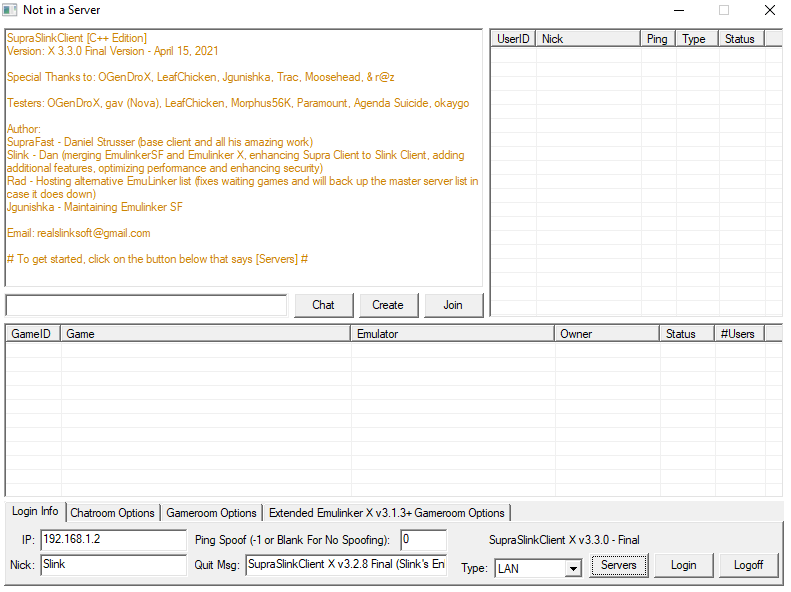
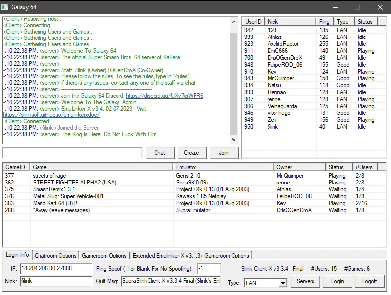

# SSClient
A modified version of SupraClient for Kaillera

A long-awaited update to Slink Client, based off unofficial fixes by myself.

Credits:
- Slink
- SupraFast

https://github.com/God-Weapon/SupraclientC

Usage: Add kailleraclient.dll to your favorite Kaillera-netplay supported emulator's directory.

3.2.1 Final Screenshots

Old Version Screenshot:
