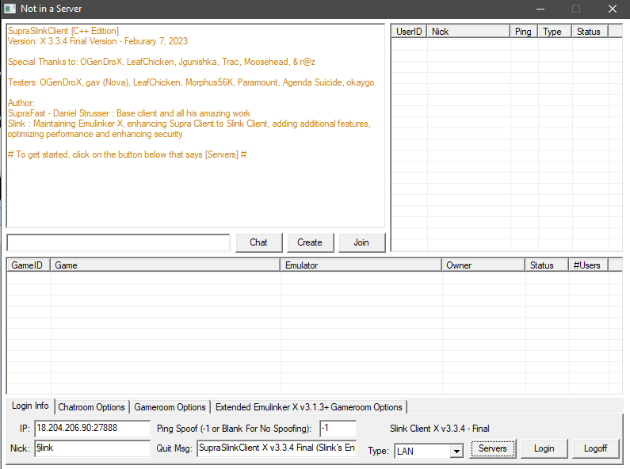

# SSClient
A modified version of SupraClient for Kaillera

A long-awaited update to Slink Client, based off unofficial fixes by Jgunishka and myself.

https://github.com/God-Weapon/SupraclientC

https://web.archive.org/web/20090608134125/http://www.d2infinity.com/supraclient.html

Usage: Add kailleraclient.dll to your favorite Kaillera-netplay supported emulator's directory.

3.3.4 Final Screenshots

Old Version Screenshot:

